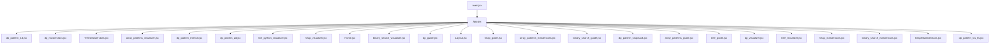

# File-Level Architecture

## Repository Stats
- **Total Files**: 29
- **Total Lines of Code**: 4394
- **Average Complexity**: 2.10

## Dependency Graph

```mermaid
graph TD;
    src_App_jsx["App.jsx"] --> src_pages_topics_dp_pattern_1d_jsx["dp_pattern_1d.jsx"];
    src_App_jsx["App.jsx"] --> src_pages_topics_dp_masterclass_jsx["dp_masterclass.jsx"];
    src_App_jsx["App.jsx"] --> src_pages_topics_TreesMasterclass_jsx["TreesMasterclass.jsx"];
    src_App_jsx["App.jsx"] --> src_pages_topics_array_patterns_visualizer_jsx["array_patterns_visualizer.jsx"];
    src_App_jsx["App.jsx"] --> src_pages_topics_dp_pattern_interval_jsx["dp_pattern_interval.jsx"];
    src_App_jsx["App.jsx"] --> src_pages_topics_dp_pattern_2d_jsx["dp_pattern_2d.jsx"];
    src_App_jsx["App.jsx"] --> src_pages_topics_live_python_visualizer_jsx["live_python_visualizer.jsx"];
    src_App_jsx["App.jsx"] --> src_pages_topics_heap_visualizer_jsx["heap_visualizer.jsx"];
    src_App_jsx["App.jsx"] --> src_pages_Home_jsx["Home.jsx"];
    src_App_jsx["App.jsx"] --> src_pages_topics_binary_search_visualizer_jsx["binary_search_visualizer.jsx"];
    src_App_jsx["App.jsx"] --> src_pages_topics_dp_guide_jsx["dp_guide.jsx"];
    src_App_jsx["App.jsx"] --> src_Layout_jsx["Layout.jsx"];
    src_App_jsx["App.jsx"] --> src_pages_topics_heap_guide_jsx["heap_guide.jsx"];
    src_App_jsx["App.jsx"] --> src_pages_topics_array_patterns_masterclass_jsx["array_patterns_masterclass.jsx"];
    src_App_jsx["App.jsx"] --> src_pages_topics_binary_search_guide_jsx["binary_search_guide.jsx"];
    src_App_jsx["App.jsx"] --> src_pages_topics_dp_pattern_knapsack_jsx["dp_pattern_knapsack.jsx"];
    src_main_jsx["main.jsx"] --> src_App_jsx["App.jsx"];
    src_App_jsx["App.jsx"] --> src_pages_topics_array_patterns_guide_jsx["array_patterns_guide.jsx"];
    src_App_jsx["App.jsx"] --> src_pages_topics_tree_guide_jsx["tree_guide.jsx"];
    src_App_jsx["App.jsx"] --> src_pages_topics_dp_visualizer_jsx["dp_visualizer.jsx"];
    src_App_jsx["App.jsx"] --> src_pages_topics_tree_visualizer_jsx["tree_visualizer.jsx"];
    src_App_jsx["App.jsx"] --> src_pages_topics_heap_masterclass_jsx["heap_masterclass.jsx"];
    src_App_jsx["App.jsx"] --> src_pages_topics_binary_search_masterclass_jsx["binary_search_masterclass.jsx"];
    src_App_jsx["App.jsx"] --> src_pages_topics_GraphsMasterclass_jsx["GraphsMasterclass.jsx"];
    src_App_jsx["App.jsx"] --> src_pages_topics_dp_pattern_lcs_lis_jsx["dp_pattern_lcs_lis.jsx"];
```
